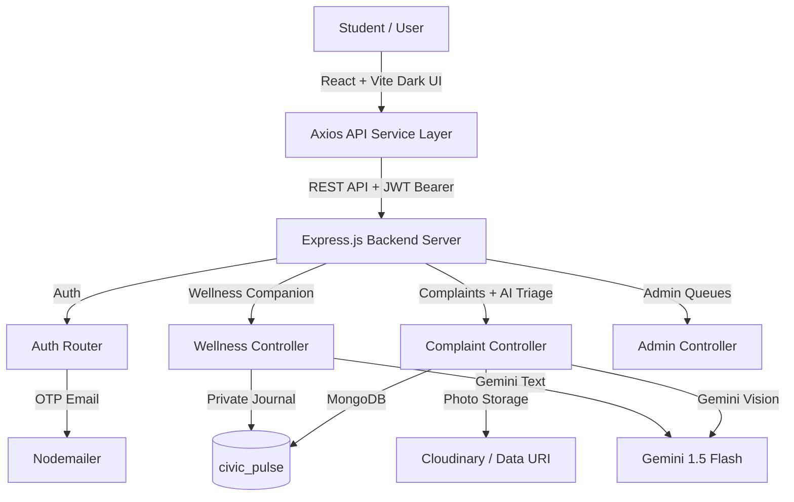

# Civic Pulse — Product Requirement Document (PRD) & Context Reference

**Project Name**: Civic Pulse (CPGRAMS-Inspired Campus & Hostel Grievance Management System)  
**Stack**: MERN Stack (MongoDB, Express.js, React + Vite, Node.js) + Gemini Multimodal Vision AI (`@google/genai`)  
**Repository Path**: `c:\Users\asayu\CS LEARNING\WEB DEVELOPMENT\CIVIC-PULSE-MERN`  
**Current Version**: 2.2.0 (Live dashboards · Wellness chat history · Legal pages · Stronger AI triage)  

---

## 1. Executive Summary & Core Idea

Civic Pulse addresses the fundamental structural flaws of basic student complaint portals (where complaints often vanish into black-hole queues, fake/spam grievances clog support channels, or staff mark tickets "resolved" without actual repair work). 

Inspired by government-grade redressal portals like **CPGRAMS**, Civic Pulse establishes an **anti-abuse, closed-loop, AI-assisted grievance lifecycle** tailored for university hostels and campus infrastructure — plus a private **stress / wellness companion** for students.

### Core Mission Statements:
1. **No Black-Hole Tickets**: Every complaint is auto-routed to assigned department officers with strict 24-hour SLA auto-escalation to Campus Administration.
2. **Two-Way Resolution Verification**: Staff cannot unilaterally mark an issue resolved. A ticket closes **only** when the student verifies the fix using a 4-digit verification OTP and inspects the "Before" vs. "After" resolution proof photo.
3. **Anti-Abuse Two-Tier Review**: Prevents staff from abusing the fake-complaint flagging system. Staff flags enter an Admin Review Queue where Campus Administration must confirm the strike. 3 strikes result in an automatic account ban.
4. **Smart Parent-Child Aggregation**: Automatically detects duplicate complaints in the same hostel block/category and groups them under a master Parent Ticket to prevent department queue flooding.
5. **AI Photo Auto-Triage**: On photo upload, Gemini (or heuristic fallback) predicts department, drafts title/description, sets priority, then auto-routes to staff.
6. **Stress Management AI**: Private wellness journal where students share thoughts and receive supportive coping guidance with persistent crisis helplines (not clinical therapy).

---

## 2. Completed Architecture & Technical Stack



### Technology Breakdown:
- **Frontend**: React 19, Vite, Tailwind CSS v4, Geist fonts, Lucide icons, React Router, Axios. Dark Vercel-inspired shell.
- **Backend**: Node.js, Express, Mongoose, JWT, bcrypt, express-rate-limit, Multer + Cloudinary.
- **Database**: MongoDB (`mongodb://127.0.0.1:27017/civic_pulse`).
- **AI**: `@google/genai` Gemini 1.5 Flash — vision triage, before/after compare, wellness reflection (heuristic fallbacks if no `GEMINI_API_KEY`).
- **Authentication**: Email + password + 6-digit OTP. **MVP: any valid email** (optional re-lock via `COLLEGE_EMAIL_DOMAIN` env). Google SSO removed.

---

## 3. Frontend Routes (React Router)

| Route | Access | Purpose |
| :--- | :--- | :--- |
| `/` | Public | Dark landing / product pitch |
| `/login` | Public | Sign in / register / OTP |
| `/track`, `/track/:ticketId` | Public | Live ticket tracker (API) |
| `/app` | Student | Community + my complaints |
| `/wellness` | Student | Stress companion journal |
| `/staff` | Staff | Assigned queue |
| `/admin` | Admin | Escalated / invalid / users |

---

## 4. Implemented Features & Workflow Breakdown

### Feature 1: Open Email Registration & OTP Login (MVP)
- **MVP policy**: Any valid email may register. Set `COLLEGE_EMAIL_DOMAIN` (e.g. `@yourcollege.edu.in`) to restore domain lock.
- **6-Digit OTP**: Activates account (`isVerified: true`). Dev: OTP often printed in backend logs if mail is unset.
- **UI**: [`LoginPage.jsx`](frontend/src/components/LoginPage.jsx) + [`AuthForm.jsx`](frontend/src/components/AuthForm.jsx).

### Feature 2: 5-State Complaint Lifecycle & Audit Trail
```
[PENDING] ────► [IN_PROGRESS] ────► [RESOLVED_BY_STAFF] ────► [VERIFIED_CLOSED]
   ▲                                         │
   └────────────────── [REOPENED] ◄──────────┘
```
- Staff/admin **cannot** jump `RESOLVED_BY_STAFF → VERIFIED_CLOSED` (student OTP only).
- Verify/reject requires **filer ownership**.
- Staff may only update tickets **assigned to them** (admin override).

### Feature 3: Two-Way Resolution Handshake OTP
- Staff marks `RESOLVED_BY_STAFF` + optional after photo → 4-digit OTP emailed (48h).
- Student verifies in [`ResolutionVerifyModal.jsx`](frontend/src/components/ResolutionVerifyModal.jsx) with before/after comparison.
- AI before/after compare uses real before-image buffer when available.

### Feature 4: Parent-Child Ticket Aggregation
- Same `hostelBlock` + `category` + active status → child under existing parent; `linkedCount` updated.

### Feature 5: Two-Tier Anti-Abuse Invalid System
- Staff flag → Admin confirm (strike / ban at 3) or reject flag.

### Feature 6: Photo → AI Auto-Triage (Upload-First Filing)
1. Student uploads photo in [`FileTicketModal.jsx`](frontend/src/components/FileTicketModal.jsx).
2. Frontend calls `POST /api/complaints/analyze`.
3. AI returns `predictedCategory`, `suggestedTitle`, `suggestedDescription`, `suggestedPriority`, `aiSummary`, `confidenceScore`.
4. Form auto-fills; student can edit; submit routes to matching department staff.
5. On create, if confidence ≥ 0.7, AI category wins for routing; empty title/description filled from AI drafts.

### Feature 7: Stress Management AI (Wellness Companion)
- Private journal at `/wellness` ([`WellnessPage.jsx`](frontend/src/components/WellnessPage.jsx)).
- Student shares thoughts → Gemini (or fallback) returns mood, supportive reply, coping exercises.
- Persistent **helpline banner** (campus counseling + Tele-MANAS / iCall).
- Keyword + model **crisisFlag** surfaces urgent human-support messaging.
- Explicitly **not therapy / not diagnosis / not emergency care**.
- Data model: [`wellness.models.js`](backend/src/models/wellness.models.js).

---

## 5. API Endpoints Reference

### Authentication (`/api/auth`)
| Method | Endpoint | Description | Auth |
| :--- | :--- | :--- | :--- |
| `POST` | `/api/auth/register` | Register with any valid email (MVP) | No |
| `POST` | `/api/auth/verify-otp` | Verify registration OTP | No |
| `POST` | `/api/auth/login` | Login → JWT | No |
| `GET` | `/api/auth/me` | Current user | JWT |

### Complaints (`/api/complaints`)
| Method | Endpoint | Description | Auth |
| :--- | :--- | :--- | :--- |
| `GET` | `/api/complaints/public` | Public parent feed | No |
| `GET` | `/api/complaints/track/:ticketId` | Track by ticket ID | No |
| `POST` | `/api/complaints/analyze` | AI photo triage preview (multipart `image`) | Student |
| `POST` | `/api/complaints` | File complaint + AI routing | Student |
| `GET` | `/api/complaints/my` | Own complaints | Student |
| `POST` | `/api/complaints/:id/upvote` | Toggle upvote | Student |
| `POST` | `/api/complaints/:id/verify-resolution` | OTP close | Student (filer) |
| `POST` | `/api/complaints/:id/reject-resolution` | Reopen | Student (filer) |
| `GET` | `/api/complaints/assigned` | Staff assigned queue | Staff |
| `PATCH` | `/api/complaints/:id/status` | State machine (+ afterImage) | Staff/Admin |
| `PATCH` | `/api/complaints/:id/request-invalid` | Flag for admin | Staff |

### Wellness (`/api/wellness`)
| Method | Endpoint | Description | Auth |
| :--- | :--- | :--- | :--- |
| `POST` | `/api/wellness/reflect` | Share thoughts → AI companion reply | Student |
| `GET` | `/api/wellness/my` | Private journal history + helplines | Student |

### Admin (`/api/admin`)
| Method | Endpoint | Description | Auth |
| :--- | :--- | :--- | :--- |
| `POST` | `/api/admin/create-staff` | Provision staff | Admin |
| `GET` | `/api/admin/users` | User directory | Admin |
| `PATCH` | `/api/admin/users/:id/ban` | Toggle ban | Admin |
| `GET` | `/api/admin/complaints/escalated` | >24h idle queue | Admin |
| `GET` | `/api/admin/complaints/all` | All complaints | Admin |
| `GET` | `/api/admin/complaints/invalid-review` | Invalid review queue | Admin |
| `PATCH` | `/api/admin/complaints/:id/confirm-invalid` | Confirm strike | Admin |
| `PATCH` | `/api/admin/complaints/:id/reject-invalid` | Reject flag | Admin |

---

## 6. Seeded Test Credentials

| Role | Email | Password | Assigned Dept |
| :--- | :--- | :--- | :--- |
| **Chief Admin** | `admin@yourcollege.edu.in` | `AdminPassword123!` | All Campus |
| **Electricity Staff** | `electrician@yourcollege.edu.in` | `StaffPassword123!` | Electricity |
| **Plumbing Staff** | `plumbing@yourcollege.edu.in` | `StaffPassword123!` | Water |
| **Mess Manager Staff** | `mess@yourcollege.edu.in` | `StaffPassword123!` | Food & Mess |
| **Maintenance Staff** | `maintenance@yourcollege.edu.in` | `StaffPassword123!` | Miscellaneous |
| **Verified Student** | `student@yourcollege.edu.in` | `StudentPassword123!` | Student Body |

New signups for MVP may use **any email** (still OTP-verified).

---

## 7. Environment Notes

| Variable | Purpose |
| :--- | :--- |
| `GEMINI_API_KEY` | Enables live Gemini vision + wellness (fallback heuristics if missing) |
| `COLLEGE_EMAIL_DOMAIN` | Optional; empty = any email (MVP). Example: `@yourcollege.edu.in` |
| `MONGODB_URI` / JWT / Cloudinary / SMTP | Standard app secrets |

**Frontend**: Vite (commonly `http://localhost:5173` or `5174`)  
**Backend**: `http://localhost:8000`  
